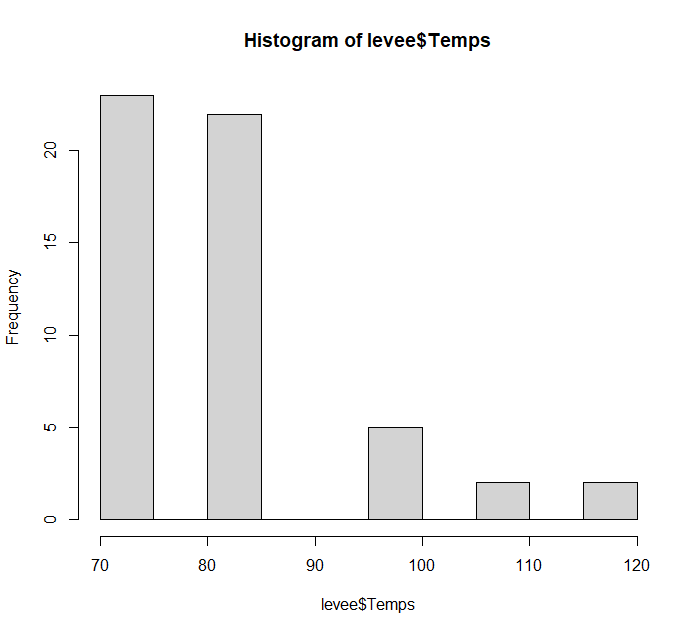
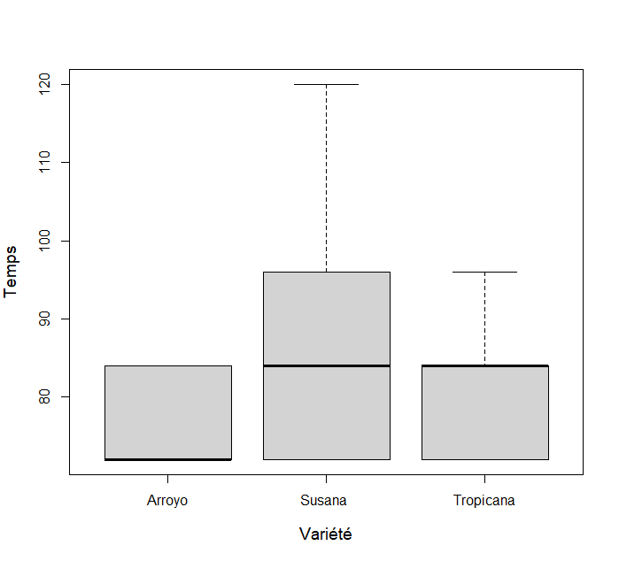
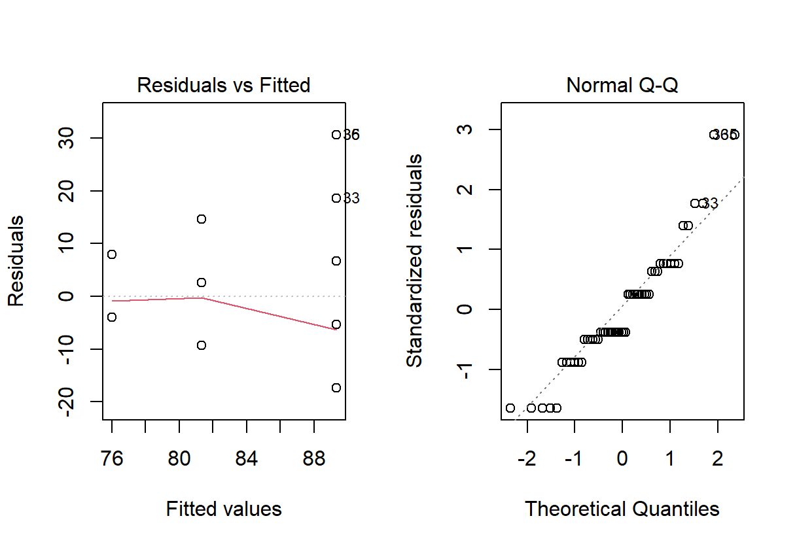
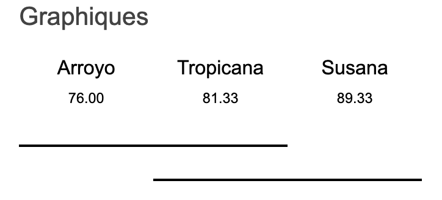
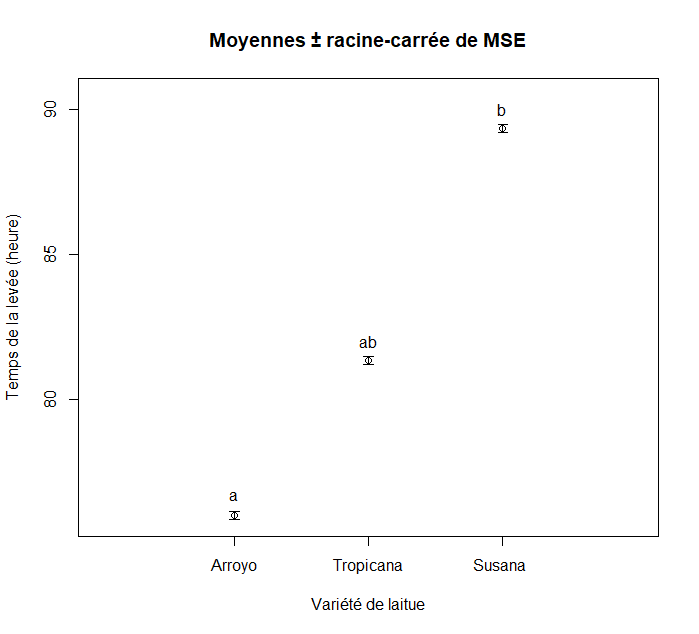

# Germination de laitues

## Introduction

Pour ce projet, nous nous attarderons au temps de germination de trois espèces de laitues : la laitue Arroyo de type romaine, la laitue Susana de type pommé «butterhead» et la laitue Tropicana de type batavia. Les types sont à titre indicatif, car nous nous intéressons aux variétés entre elles. De plus, dans le cadre de cette expérience, la germination sera définie par le temps de la levée, c’est-à-dire le temps que la plantule émerge de la terre.

## Hypothèses

*H*<sub>o</sub> : Le temps de germination des quatre espèces de laitues ne diffère pas 

*H*<sub>a</sub> : Le temps de germination des quatre espèces de laitues diffère

ou

*H*<sub>o</sub> : μArroyo = μSusana = μTropicana 

*H*<sub>a</sub> : μArroyo ≠ μSusana ≠ μTropicana

*α* = 0.05

## Méthodes

### Protocole d’échantillonnage

Nous avons utilisé 18 répétitions sur trois groupes (Arroyo, Susana et Tropicana).
Concrètement, nous avons pigé aléatoirement 18 semences de chaque variété dans
des paquets contenant entre 65 et 100 semences. Toutes les semences ont moins d’un
an et elles possèdent un taux de germination supérieur à 95%. Chacune de celle-ci a
été disposée de façon aléatoirement dans un plateau multicellules de 72 cellules où
seulement les 54 premières cellules furent utilisées. Pour placer les semences
aléatoirement, nous avons utilisé R en créant une liste avec 54 entrées divisées en trois
variétés :

```r
#disposition aléatoire des semences
Varietes <- c("Arroyo","Arroyo","Arroyo","Arroyo","Arroyo","Arroyo",
              "Arroyo","Arroyo","Arroyo","Arroyo","Arroyo","Arroyo",
              "Arroyo","Arroyo","Arroyo","Arroyo","Arroyo","Arroyo",
              "Susana","Susana","Susana","Susana","Susana","Susana",
              "Susana","Susana","Susana","Susana","Susana","Susana",
              "Susana","Susana","Susana","Susana","Susana","Susana",
              "Tropicana","Tropicana","Tropicana","Tropicana",
              "Tropicana","Tropicana","Tropicana","Tropicana",
              "Tropicana","Tropicana","Tropicana","Tropicana",
              "Tropicana","Tropicana","Tropicana","Tropicana",
              "Tropicana","Tropicana")
sample(Varietes, 54)
> sample(Varietes, 54)
 [1] "Arroyo"    "Susana"    "Arroyo"    "Tropicana" "Susana"   
 [6] "Susana"    "Susana"    "Tropicana" "Tropicana" "Susana"   
[11] "Arroyo"    "Susana"    "Susana"    "Arroyo"    "Tropicana"
[16] "Tropicana" "Tropicana" "Tropicana" "Tropicana" "Susana"   
[21] "Arroyo"    "Tropicana" "Susana"    "Tropicana" "Susana"   
[26] "Arroyo"    "Tropicana" "Arroyo"    "Arroyo"    "Arroyo"   
[31] "Susana"    "Tropicana" "Arroyo"    "Susana"    "Tropicana"
[36] "Arroyo"    "Arroyo"    "Susana"    "Tropicana" "Susana"   
[41] "Arroyo"    "Tropicana" "Susana"    "Arroyo"    "Tropicana"
[46] "Tropicana" "Arroyo"    "Susana"    "Arroyo"    "Tropicana"
[51] "Susana"    "Arroyo"    "Susana"    "Arroyo" 
```

Le plateau a été déposé dans un endroit avec une température constante et une lumière homogène. Suite au semis, toutes les 12 heures (à 7h45 et à 19h45 dans notre cas précis), une vérification de la levée fut effectuée. Dès que l’hypocotyle fait son apparition, on note le nombre d’heures depuis le semis pour chaque observation. Après 120 heures, nous avons obtenu tous les résultats (voir « semis- laitue-dataframe.csv »), en voici un aperçu :

```r
#importation du jeu de données
levee <- read.csv(file.choose(), header = TRUE)
levee$Variete <- as.factor(levee$Variete) # transformer en facteur
head(levee)
  Temps Variete
1    72  Arroyo
2    72  Arroyo
3    72  Arroyo
4    72  Arroyo
5    72  Arroyo
6    72  Arroyo
```

## Analyse & résultats

### Visualisations

```r
#visualisation de la distribution
hist(levee$Temps)
```



```r
#visualisons nos données
boxplot(Temps ~ Variete, data = levee,
        ylab = "Temps",
        xlab = "Variété", cex.lab = 1.2)
```



Les données sont similaires avec des valeurs extrêmes plus importantes dans le cas de Susana et une moyenne plus basse pour Aroyo. De plus, on remarque que la distribution ne semble pas suivre la courbe d’une distribution normale. À l’aide de l’ANOVA, vérifions rapidement si l’on respecte les suppositions d'homogénéité de la variance et la normalité pour définir si cette analyse peut être utilisée :

```r
m1 <- aov(Temps ~ Variete, data = levee)
par(mfrow = c(1, 2))
plot(m1)
```



Étant donné qu’on observe une hétérogénéité des variances (les variances augmentent avec les valeurs prédites) et, surtout, que la distribution ne suit pas la courbe d’une distribution normale (on constate plutôt une distribution quasi poisson), on utilisera le modèle linéaire généralisé afin de vérifier les hypothèses.

### Test et analyse

Appliquons maintenant le modèle linéaire généralisé :

```r
## modèle linéaire généralisé
res.glm.qp <- glm(Temps ~ Variete, data=levee, family = quasipoisson)
summary(res.glm.qp)

Call:
glm(formula = Temps ~ Variete, family = quasipoisson, data = levee)

Deviance Residuals: 
    Min       1Q   Median       3Q      Max  
-1.8986  -0.5700  -0.4629   0.6968   3.0814  

Coefficients:
                 Estimate Std. Error t value Pr(>|t|)    
(Intercept)       4.33073    0.03150 137.467  < 2e-16 ***
VarieteSusana     0.16164    0.04286   3.772 0.000423 ***
VarieteTropicana  0.06782    0.04382   1.548 0.127836    
---
Signif. codes:  0 ‘***’ 0.001 ‘**’ 0.01 ‘*’ 0.05 ‘.’ 0.1 ‘ ’ 1

(Dispersion parameter for quasipoisson family taken to be 1.35772)

    Null deviance: 87.369  on 53  degrees of freedom
Residual deviance: 67.733  on 51  degrees of freedom
AIC: NA

Number of Fisher Scoring iterations: 4
```

Nous considérons l’analyse comme étant valide puisque nous avons une indépendance des observations (chaque graine a été sélectionnée de façon aléatoire) et les valeurs des déviances sont près des valeurs de degrés de liberté :

- « Null deviance: 87.369  on 53  degrees of freedom »;

- « Residual deviance: 67.733  on 51  degrees of freedom ».

Par ailleurs, nous remarquons que la variété Arroyo (*Intercept*) est significativement différente de la variété Susana (*P* < 0.001). Vu qu’un qu'il y a au moins une moyenne qui diffère des autres, nous pouvons effectuer un test de comparaison de moyennes dans le but de vérifier les autres cas de figure.

```r
# comparaison des variétés 
library(multcomp)
amod_glht <- glht(res.glm.qp, linfct = mcp(Variete = "Tukey"))
summary(amod_glht)


     Simultaneous Tests for General Linear Hypotheses

Multiple Comparisons of Means: Tukey Contrasts

Fit: glm(formula = Temps ~ Variete, family = quasipoisson, data = levee)

Linear Hypotheses:
                         Estimate Std. Error z value Pr(>|z|)    
Susana  - Arroyo == 0     0.16164    0.04286   3.772 0.000496 ***
Tropicana - Arroyo == 0   0.06782    0.04382   1.548 0.268559    
Tropicana - Susana  == 0 -0.09382    0.04209  -2.229 0.066327 .  
---
Signif. codes:  0 ‘***’ 0.001 ‘**’ 0.01 ‘*’ 0.05 ‘.’ 0.1 ‘ ’ 1
(Adjusted p values reported -- single-step method)
```

On confirme ici que la moyenne entre Susana et Arroyo diffère, mais on ne note pas de différence significative dans la comparaison des autres groupes malgré que celle entre Tropicana et Susana est légèrement supérieure au seuil *α* = 0.05.

### Graphiques



```r
## Graphique des resultats
moy.orig <- tapply(X = levee$Temps, INDEX = levee$Variete, 
                   FUN = mean)
moy <- sort(moy.orig)
MSE <- summary(m2)[[1]][2, "Mean Sq"]
##calculer racine carrée de MSE
sqrt.MSE <- sqrt(MSE)
##calculer les limites des barres d'erreur
lim.sup <- moy + sqrt.MSE
lim.inf <- moy - sqrt.MSE
##création d'un graphique vide sans axe des x
par(mfrow = c(1, 1))
plot(x = 0, y = 0, type = "n",
     ylim = c(min(lim.inf), max(lim.sup)+1),
     xlim = c(0, 4), xlab = "Variété de laitue",
     ylab = "Temps de la levée (heure)",
     main = "Moyennes ± racine-carrée de MSE",
     xaxt = "n")
##ajouter axe des x
axis(side = 1, at = c(1, 2, 3),
     labels = names(moy))
##ajouter moyennes
points(x = c(1, 2, 3),
       y = moy)
##ajouter barres d'erreurs
arrows(x0 = c(1, 2, 3),
       y0 = lim.inf,
       x1 = c(1, 2, 3),
       y1 = lim.sup, length = 0.05,
       angle = 90, code = 3)
##ajouter les lettres, lim.sup + 0.05
text(x = 1, y = lim.sup[1] + 0.55, labels = "a")
text(x = 2, y = lim.sup[2] + 0.55, labels = "ab")
text(x = 3, y = lim.sup[3] + 0.55, labels = "b")
```



## Discussion

On rejette *H*<sub>o</sub> et on conclut qu’il y a une différence dans le temps de germination de nos trois espèces de laitue (Arroyo, Tropicana et Susana). La différence est particulièrement notable entre la variété Susana et la variété Arroyo. Le fait que ce sont des laitues de différent type influence peut-être le temps de levée, ce qui serait intéressant à valider avec une autre expérience.
